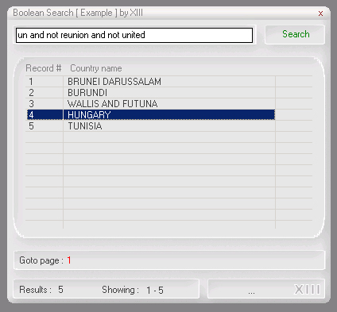



## ADO Boolean Search \[ AND / OR / NOT / AND NOT \]

### Description

This is the only one ADO Boolean Search on Planet Source Code !!! [ AND / OR / NOT / AND NOT ]
 
### More Info
 

             |
---                |---
**Submitted On**   |2002-05-09 14:32:52
**By**             |[Alexander Kossovsky](https://github.com/Planet-Source-Code/PSCIndex/blob/master/ByAuthor/alexander-kossovsky.md)
**Level**          |Advanced
**User Rating**    |4.6 (23 globes from 5 users)
**Compatibility**  |VB 3\.0, VB 4\.0 \(16\-bit\), VB 4\.0 \(32\-bit\), VB 5\.0, VB 6\.0, VB Script, ASP \(Active Server Pages\) , VBA MS Access, VBA MS Excel
**Category**       |[Databases/ Data Access/ DAO/ ADO](https://github.com/Planet-Source-Code/PSCIndex/blob/master/ByCategory/databases-data-access-dao-ado__1-6.md)
**World**          |[Visual Basic](https://github.com/Planet-Source-Code/PSCIndex/blob/master/ByWorld/visual-basic.md)
**Archive File**   |[ADO\_Boolea879695292002\.zip](https://github.com/Planet-Source-Code/alexander-kossovsky-ado-boolean-search-and-or-not-and-not__1-35227/archive/master.zip)

